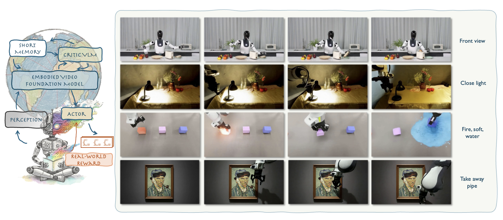

# WoW: Harnessing Intuitive Physics from a Scalable Embodied World Model

> **This is the anonymous project page for ICLR 2026 submission: [WoW: Harnessing Intuitive Physics from a Scalable Embodied World Model](https://wow-world-model-iclr.github.io/)**

## 📖 Paper

**WoW: Harnessing Intuitive Physics from a Scalable Embodied World Model**  
Anonymous ICLR 2026 Submission  
Paper ID: [Under Review]



---

## 🔑 Abstract

<p style="text-align: justify; text-justify: inter-word;">
World models have recently emerged as a powerful paradigm for robotics, integrating perception, action, and reasoning. However, most existing world models focus on narrow domains or rely heavily on simulation, limiting their ability to generalize to real-world embodied interaction. We introduce <strong>WoW</strong> (Harnessing Intuitive Physics from a Scalable Embodied World Model), a large-scale embodied world model designed to capture intuitive physics and enable scalable robot learning. WoW unifies multimodal inputs from diverse real and simulated datasets, and leverages embodied interaction to learn dynamics that transfer robustly across environments and robot platforms. Across extensive experiments, WoW demonstrates strong generalization in manipulation and long-horizon planning, enabling closed-loop control and real-world deployment. Our results highlight that embodied interaction and large-scale training are critical to building world-omniscient models for robotics.
</p>

---

## 📋 Citation

```bibtex
@article{anonymous2025wow,
    author    = {Anonymous},
    title     = {WoW: Harnessing Intuitive Physics from a Scalable Embodied World Model},
    journal   = {ICLR 2026 Submission},
    year      = {2026},
    note      = {Under Review}
}